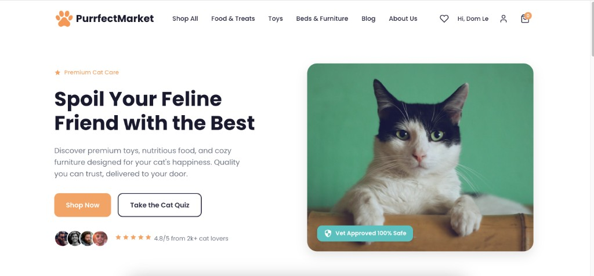

# Purrfect Market

React (FE) + Spring Boot (BE) application.



## Run in browser

### Frontend (FE)

Vite proxies `/api` to the Spring Boot app on **port 8080**. If you only run the frontend and see **`http proxy error` / `ECONNREFUSED 127.0.0.1:8080`**, start the backend (next section) or use **both together** from the repo root:

```bash
npm install
npm run dev
```

That runs Spring Boot and Vite in one terminal. Otherwise run the backend in one terminal, then the frontend in another:

```bash
cd Frontend
npm install
npm run dev
# or: npm start  (same as dev)
```

Open [http://localhost:5173](http://localhost:5173) — landing page. Products: [http://localhost:5173/products](http://localhost:5173/products).

If port 5173 is already in use, stop the other process (or another Vite instance) so the app stays on 5173 — Stripe redirects and the API proxy expect that port.

### Backend (BE)

Required for `/api` (auth, products, checkout, etc.) when using the dev frontend.

```bash
cd Backend
mvn spring-boot:run
```

Use **`spring-boot`** with a hyphen — `mvn springboot:run` will fail (wrong plugin name).

API: [http://localhost:8080/api/hello](http://localhost:8080/api/hello)

### Auth (session-based)

- **Login**: `POST /api/auth/login` (email, password)
- **Register**: `POST /api/auth/register` (name, email, password)
- **Logout**: `POST /api/auth/logout`
- **Current user**: `GET /api/auth/me`

Test user: `test@purrfect.com` / `password`

### Main admin

- On first startup, if no user exists with **quydung119@gmail.com**, one is created with password **`PurrfectAdmin!2025`** and role **MAIN_ADMIN**. If that email already exists (e.g. you registered first), the next run promotes it to **MAIN_ADMIN**.
- After logging in as main admin, open **Admin** in the header for orders, products/inventory, newsletter tools, and **Users** (promote/demote Main Admin vs User; at least one Main Admin must remain).
- Admin APIs are under `/api/admin/**` (403 for everyone else). Change the default admin password after first login if others can access your machine.

### Add Product (API)

```bash
curl -X POST http://localhost:8080/api/products \
  -H "Content-Type: application/json" \
  -d '{"name":"Product Name","description":"Description","price":19.99,"category":"Toys","imageUrl":"https://example.com/image.jpg","rating":4.8,"reviewCount":50,"badge":null}'
```

### Database (H2)

- File-based at `Backend/data/purrfect.mv.db` (persists across restarts)
- H2 Console: http://localhost:8080/h2-console (JDBC URL: `jdbc:h2:file:./data/purrfect`)
- Newsletter signups are stored in table `newsletter_subscribers` (`email`, `subscribed_at`). Query or export from H2 when you run campaigns.

### Resend (welcome email)

1. Create an account at [resend.com](https://resend.com) and create an **API key** (`re_...`).
2. Set **`RESEND_API_KEY`** (or `resend.api.key` in `application.properties`) before starting the backend. Without it, subscriptions still save; no email is sent.
3. For quick tests, use the default **From** address `Purrfect Market <onboarding@resend.dev>` (Resend’s test sender). You can only send to **your own verified email** until you add and verify a domain in Resend, then set e.g. `resend.from=Purrfect Market <newsletter@yourdomain.com>`.
4. Optional: `resend.reply-to=` for replies.

### Stripe Payments (test mode)

Checkout uses Stripe in **test mode** — no real charges. Setup:

1. Create a free Stripe account at [stripe.com](https://stripe.com).
2. In the [Stripe Dashboard](https://dashboard.stripe.com), enable **Developers → API keys** and copy the **Secret key** (starts with `sk_test_`).
3. Set the key before starting the backend:

   ```bash
   cd Backend
   export STRIPE_API_KEY=sk_test_your_key_here
   mvn spring-boot:run
   ```

   Or add to `Backend/src/main/resources/application.properties`:

   ```
   stripe.api.key=sk_test_your_key_here
   ```

4. When you click **Proceed to payment**, you’ll be redirected to Stripe Checkout.
5. Use Stripe test cards, e.g. `4242 4242 4242 4242`, any future expiry, any CVC. See [Stripe test cards](https://stripe.com/docs/testing#cards).

### Orders (payment & shipping)

Each order stores **payment** status (`PAID`, `PENDING`) and **shipping** status (`PREPARING`, `SHIPPED`, `DELIVERED`). New checkouts start as **Paid** + **Preparing shipment**. To simulate progress locally, update rows in the H2 console, e.g. `UPDATE orders SET shipping_status = 'SHIPPED' WHERE id = 1;`.
